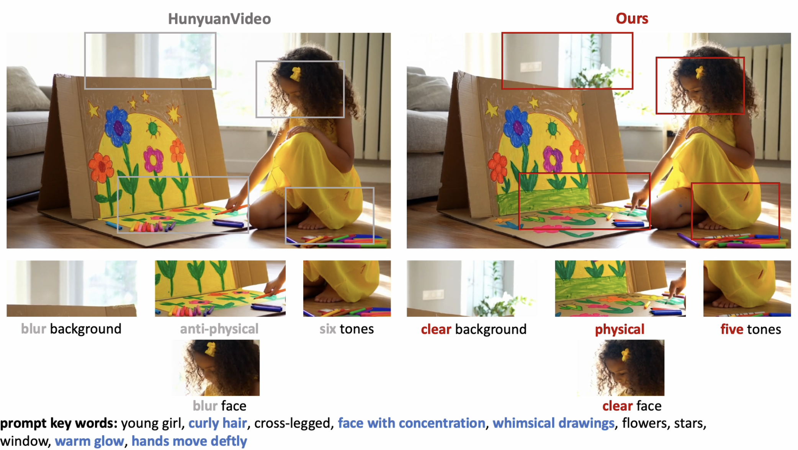

# Enhance-A-Video

This repository is the official implementation of [Enhance-A-Video: Better Generated Video for Free](https://oahzxl.github.io/Enhance_A_Video/).



## News
- 2024-12-20: Enhance-A-Video is now available for [CogVideoX](https://github.com/THUDM/CogVideo) and [HunyuanVideo](https://github.com/Tencent/HunyuanVideo)!

## Getting Started

Install the dependencies:

```bash
conda create -n enhanceAvideo python=3.10
conda activate enhanceAvideo
pip install -r requirements.txt
```

Generate videos:

```bash
python cogvideox.py
python hunyuanvideo.py
```
