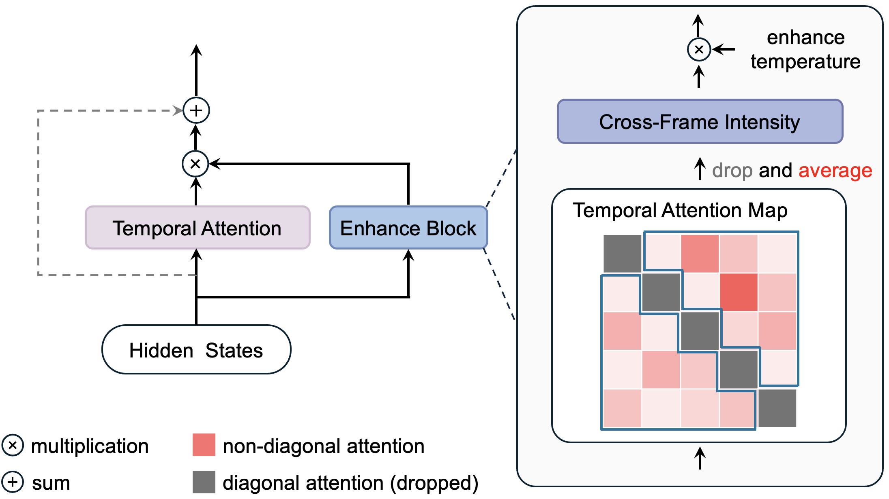

# Enhance-A-Video

[Blog](https://oahzxl.github.io/Enhance_A_Video/) | [Twitter](https://x.com/YangL_7/status/1870116980717695243)

This repository is the official implementation of [Enhance-A-Video: Better Generared Video for Free](https://oahzxl.github.io/Enhance_A_Video/).


## News
- 2024-12-22: We have [ComfyUI-Hunyuan](https://github.com/kijai/ComfyUI-HunyuanVideoWrapper) Version 🚀!
- 2024-12-20: Enhance-A-Video is now available for [CogVideoX](https://github.com/THUDM/CogVideo) and [HunyuanVideo](https://github.com/Tencent/HunyuanVideo)!
- 2024-12-20: We have released code and [blog](https://oahzxl.github.io/Enhance_A_Video/) for Enhance-A-Video!

## Method



We design an Enhance Block as a parallel branch. This branch computes the average of non-diagonal elements of temporal attention maps as cross-frame intensity (CFI). An enhanced temperature parameter multiplies the CFI to enhance the temporal attention output.

## Getting Started

Install the dependencies:

```bash
conda create -n enhanceAvideo python=3.10
conda activate enhanceAvideo
pip install -r requirements.txt
```

Generate videos:

```bash
python cogvideox.py
python hunyuanvideo.py
```
